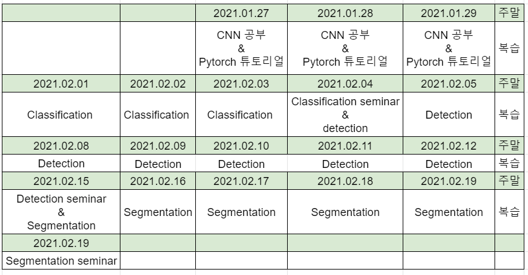
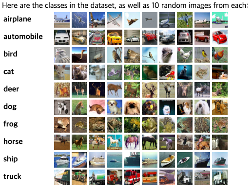
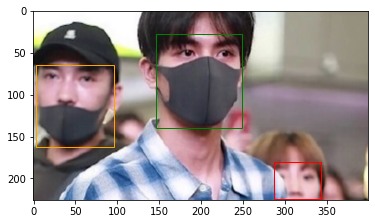
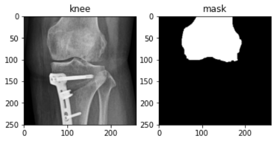

# CNN Tutorial

- CNN의 대표적인 Classification, Detection and Segmentation에 관한 기초 공부를 위한 튜토리얼을 진행하였고 세미나를 통해서 내용을 정리 하였다.

 

### 일정

 

## Classification

 

- CIFAR-10 데이터를 이용한 Classification 구현
- VGG-16 사용

 

 

## Detection

 

- Kaggle의 face mask detection 데이터를 이용한 Detection 구현
- Faster R-CNN 사용

 

 

## Segmentation

 

- Knee 데이터를 이용하여 femur Segmentation 구현
- U-Net 사용

 

  