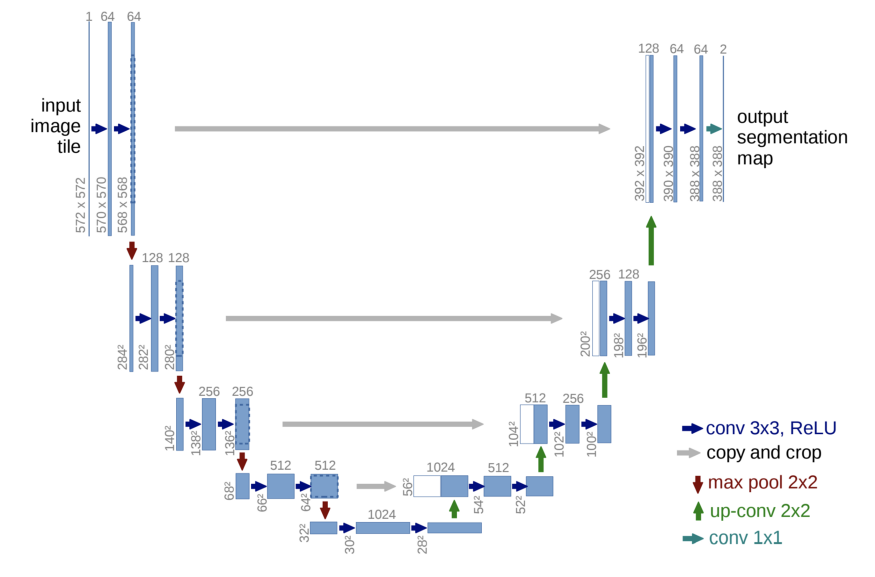

# U-Net 

Biomedical 분야에서 이미지 분할(Image Segmentation)을 목적으로 제안된 End-to-End 방식의 Fully-Convolutional Network 기반 모델

 

네트워크 구성 형태(U)로 인해 U-Net이라는 이름이 붙여졌다.

 

 

### Segmentaion 이란?

크게 Sementic Segmentaion과 Instance Segmentation으로 나뉜다.

- Sementic Segmentation: 같은 class의 instance를 구별하지 않는다.
  - ex) 홍길동/이순신 = 사람
  - 픽셀 자체가 어떤 class에 속하는지에만 초점이 맞춰져있다.
- Instance Segmentation:  같은 class내에서 도 구별을 시키는 것
  - ex) 홍길동 = 사람1, 이순신 = 사람2

 

- Classification: input에 대해서 하나의 label을 예측
- Localization/Detection: object의 label을 예측하면서 그 물체가 어디에 있는지 정보를 제공, bounding box를 이용해서 위치 표시
- Segmentation: 모든 픽셀의 label을 예측

 

