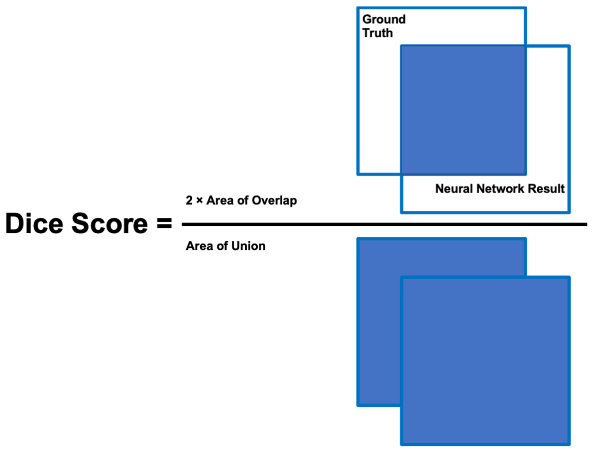

# Dice Coefficient

 

> image segmentation을 진행 한 후 predict가 잘 됬는지 확인하기 위해서 dice score를 사용하고자 공부하게 되었다.

 

 

모델 성능 평가의 척도 중 하나

일반적으로 잘 알려진 IOU(intersection over union)와 유사한 방식

예측 마스크 영역과 실제 마스크 영역이 서로 얼마나 겹치는지 측정

겹치는 영역이 1에 가까울수록 성능이 좋고, 0에 가까울수록 성능이 좋지 않다.

 

 